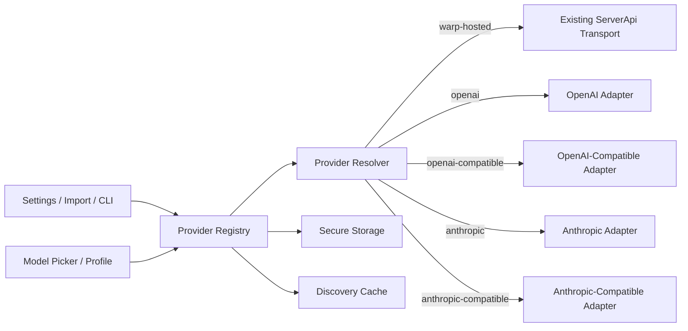

# BYO Providers and Local Models for Warp Agent Tech Spec

## Context

`PRODUCT.md` defines the user-visible provider behavior. The current implementation already has local API-key storage, a BYO key settings section, plan and workspace policy gating, model picker affordances, and a server-mediated Warp Agent request path. This spec adds a provider registry and a direct-provider transport path without removing the existing Warp-hosted path.

Relevant code:

- `crates/ai/src/api_keys.rs:7` stores the current BYO API keys under a secure-storage key named `AiApiKeys`.
- `crates/ai/src/api_keys.rs:20` defines fixed provider key slots for Google, Anthropic, OpenAI, and OpenRouter.
- `crates/ai/src/api_keys.rs:72` updates individual provider keys and writes them back to secure storage.
- `crates/ai/src/api_keys.rs:120` builds `warp_multi_agent_api::request::settings::ApiKeys` only when BYO keys are allowed for the current user.
- `app/src/workspaces/user_workspaces.rs:476` gates BYO keys through workspace billing metadata or the `SoloUserByok` feature flag for solo users.
- `app/src/settings_view/ai_page.rs:6306` renders the existing API Keys widget with fixed OpenAI, Anthropic, and Google inputs.
- `app/src/settings_view/ai_page.rs:6508` shows the current upgrade CTA when BYO keys are unavailable.
- `app/src/settings_view/ai_page.rs:6569` renders the existing Warp credit fallback toggle.
- `app/src/settings/ai.rs:1197` persists `can_use_warp_credits_with_byok` at `cloud_platform.third_party_api_keys.can_use_warp_credits_with_byok`.
- `app/src/ai/llms.rs:28` checks whether a selected first-party provider is using a BYO key.
- `app/src/terminal/input/models/data_source.rs:494` uses BYO availability to show a "bring your own key" path in model picker copy.
- `app/src/ai/agent/api.rs:118` carries provider API keys on `RequestParams`.
- `app/src/ai/agent/api.rs:237` reads `ApiKeyManager` and `UserWorkspaces` while constructing agent request params.
- `app/src/ai/agent/api/impl.rs:54` injects API keys into `warp_multi_agent_api::Request` settings.
- `app/src/ai/agent/api/impl.rs:139` sends all built-in agent requests through `server_api.generate_multi_agent_output`.
- `app/src/server/server_api.rs:1135` posts `generate_multi_agent_output` requests to Warp's `/ai/multi-agent` or passive-suggestions endpoint and decodes Warp server SSE events.
- `crates/warpui_extras/src/user_preferences/toml_backed.rs:25` implements human-editable TOML-backed settings.

The new architecture should treat the current server path as the `warp-hosted` transport and add a sibling direct-provider path that can run without forwarding prompt content or credentials through Warp inference services.

## Proposed changes

### Provider registry

Add a provider registry model that owns non-secret provider metadata, default provider selection, discovery cache references, and policy state. It should live near the existing AI models and settings code rather than inside the settings view, because it must be shared by Settings, model pickers, request construction, import/export, and tests.

Initial provider kinds:

```rust
pub enum ProviderKind {
    WarpHosted,
    OpenAI,
    Anthropic,
    OpenAICompatible,
    AnthropicCompatible,
}
```

The cross-language provider contract is:

```ts
export type ProviderKind =
  | "warp-hosted"
  | "openai"
  | "anthropic"
  | "openai-compatible"
  | "anthropic-compatible";

export type AuthConfig =
  | { type: "none" }
  | { type: "apiKey"; source: "keychain"; secretRef: string }
  | { type: "apiKey"; source: "env"; envVar: string }
  | { type: "bearerToken"; source: "keychain"; secretRef: string };

export interface ProviderCapabilities {
  tools: boolean | "auto";
  vision: boolean | "auto";
  structuredOutputs: boolean | "auto";
  promptCaching: boolean | "auto";
  reasoningControls: boolean | "auto";
  modelDiscovery: boolean | "auto";
}

export interface ProviderPolicy {
  allowFallbackToWarpHosted: boolean;
  allowManualModelIds: boolean;
  redactTelemetry: boolean;
  localOnly?: boolean;
  allowInManagedTeams?: boolean;
}

export interface ProviderDefaults {
  model?: string;
  stream?: boolean;
  temperature?: number;
  topP?: number;
  maxOutputTokens?: number;
  timeoutMs?: number;
}

export interface ProviderProfile {
  id: string;
  kind: ProviderKind;
  enabled: boolean;
  displayName: string;
  baseURL: string;
  auth: AuthConfig;
  headers?: Record<string, string>;
  defaults?: ProviderDefaults;
  capabilities?: Partial<ProviderCapabilities>;
  policy?: Partial<ProviderPolicy>;
  discovery?: {
    strategy: "models-endpoint" | "manual-only";
    fallbackModels?: string[];
  };
}
```

Defaults:

- `allowFallbackToWarpHosted` defaults to `false` for all direct and compatible providers.
- `allowManualModelIds` defaults to `true` for compatible providers and `false` for first-party providers unless discovery fails.
- `redactTelemetry` defaults to `true`.
- `localOnly` is inferred for localhost and loopback origins and can be explicitly set.
- `warp-hosted` is synthesized when no registry exists so existing users keep current behavior.

### Persistence and secrets

Persist non-secret metadata in the existing TOML-backed settings system. Do not add raw secrets to `settings.toml`.

Example projection:

```toml
[ai.defaults]
agent_provider = "openai-main"
agent_model = "gpt-4.1"

[ai.providers.openai-main]
kind = "openai"
enabled = true
display_name = "OpenAI direct"
base_url = "https://api.openai.com/v1"
auth_type = "api_key"
auth_source = "keychain"
secret_ref = "keychain://warp/providers/openai-main"
default_model = "gpt-4.1"
stream = true

[ai.providers.ollama-local]
kind = "openai-compatible"
enabled = true
display_name = "Ollama local"
base_url = "http://127.0.0.1:11434/v1"
auth_type = "none"
default_model = "qwen2.5-coder:14b"
stream = true
discovery_strategy = "models-endpoint"
fallback_models = ["qwen2.5-coder:14b", "llama3.1:8b"]
tools = false
vision = false
```

Implementation notes:

- Extend or replace `ApiKeyManager` with a provider-aware secret manager that can preserve existing `AiApiKeys` data.
- Keep existing fixed key slots readable during migration.
- Store provider secrets under stable provider-specific secret refs.
- Use env-var auth by resolving the environment at request time and never persisting the resolved value.
- Add redacted JSON/YAML import-export on top of the same provider profile schema. Imports that include inline values should immediately write to secure storage and persist only secret refs.

### Migration

On first registry load:

- Synthesize `warp-hosted`.
- If legacy OpenAI key exists, create `openai-main` with `kind = openai` and reuse the existing secure stored value.
- If legacy Anthropic key exists, create `anthropic-main` with `kind = anthropic` and reuse the existing secure stored value.
- Leave Google and OpenRouter legacy keys in place unless their provider support is explicitly added to this registry. They should keep current behavior until migrated by a later provider-kind expansion.
- Preserve `can_use_warp_credits_with_byok` as the initial fallback preference only for legacy BYOK behavior. Direct-provider profiles should still default fallback to off unless a migration explicitly maps the existing preference to an opt-in policy and makes that visible.

Do not remove the legacy key payload until rollback risk is acceptable. The first implementation should be able to read both the legacy secure-storage payload and the new provider secret refs.

### Request path and resolver

Introduce a provider resolver before `generate_multi_agent_output` is called.

```rust
enum ResolvedProviderTransport {
    WarpHosted,
    OpenAI,
    OpenAICompatible,
    Anthropic,
    AnthropicCompatible,
}

struct ResolvedProvider {
    profile_id: String,
    kind: ProviderKind,
    model: String,
    base_url: Url,
    auth: ResolvedAuth,
    headers: BTreeMap<String, String>,
    capabilities: ProviderCapabilities,
    policy: ProviderPolicy,
}
```

The resolver should:

- Resolve the active provider and model from conversation override, execution profile, provider defaults, then `warp-hosted`.
- Reject disabled or disallowed providers before building the request.
- Resolve secrets only for the direct-provider path.
- Freeze the resolved provider at request start so in-flight requests are not affected by later settings changes.
- Route `warp-hosted` to the existing `ServerApi::generate_multi_agent_output` flow.
- Route all other provider kinds to the new direct-provider client.

The existing `RequestParams` and `generate_multi_agent_output` shape can evolve in one of two ways:

- Add a top-level `AgentInferenceClient` that exposes the same `ResponseStream` type and delegates to either `ServerApiAgentInferenceClient` or `DirectProviderAgentInferenceClient`.
- Or split `generate_multi_agent_output` into a resolver wrapper plus the current server-specific implementation.

Prefer the top-level `AgentInferenceClient` if it keeps the caller-facing stream type stable and prevents direct-provider details from leaking into UI controllers.

### Normalized request contract

Use a provider-neutral request and stream event contract between Warp Agent and direct-provider adapters. The adapter owns provider-specific payload conversion.

```ts
export interface NormalizedMessage {
  role: "system" | "developer" | "user" | "assistant" | "tool";
  content:
    | string
    | Array<
        | { type: "text"; text: string }
        | { type: "image"; url?: string; mimeType?: string; dataBase64?: string }
        | { type: "file"; url?: string; mimeType?: string; dataBase64?: string; filename?: string }
      >;
  toolCallId?: string;
  toolName?: string;
}

export interface NormalizedTool {
  name: string;
  description?: string;
  inputSchema: Record<string, unknown>;
}

export type NormalizedToolChoice =
  | { type: "auto" }
  | { type: "required" }
  | { type: "tool"; name: string };

export interface NormalizedRequest {
  providerId: string;
  model: string;
  instructions?: string;
  messages: NormalizedMessage[];
  tools?: NormalizedTool[];
  toolChoice?: NormalizedToolChoice;
  stream: boolean;
  temperature?: number;
  topP?: number;
  maxOutputTokens?: number;
  metadata?: Record<string, string>;
}

export type NormalizedStreamEvent =
  | { type: "message_start"; id?: string; model?: string }
  | { type: "text_delta"; text: string }
  | { type: "tool_call_start"; id: string; name: string }
  | { type: "tool_call_delta"; id: string; partialJson: string }
  | { type: "tool_call_stop"; id: string }
  | { type: "usage"; inputTokens?: number; outputTokens?: number; totalTokens?: number }
  | { type: "message_stop"; stopReason?: string }
  | { type: "error"; message: string; status?: number; retryable?: boolean };

export interface NormalizedResponse {
  id?: string;
  model?: string;
  outputText: string;
  stopReason?: string;
  toolCalls?: Array<{ id: string; name: string; input: unknown }>;
  usage?: { inputTokens?: number; outputTokens?: number; totalTokens?: number };
}
```

Adapters:

- `openai`: prefer OpenAI Responses API for first-party OpenAI.
- `openai-compatible`: default to Chat Completions because that is the compatibility surface most local runtimes and proxies emulate.
- `anthropic`: use Anthropic Messages API with native Anthropic headers and tool lifecycle.
- `anthropic-compatible`: use the same Messages-family adapter and mark degraded capabilities for partial implementations.

The first direct-provider implementation can support text streaming before full tool execution, but it must not advertise unsupported capabilities in the UI.

### Streaming

The direct-provider client should convert provider SSE or chunked responses into the same downstream stream type that the Warp UI already consumes, or introduce one internal normalized stream that is converted at the agent controller boundary.

Required mappings:

- OpenAI Responses SSE to `message_start`, `text_delta`, `tool_call_*`, `usage`, and `message_stop`.
- OpenAI Chat Completions deltas to the same normalized events.
- Anthropic Messages SSE events such as `message_start`, `content_block_start`, `content_block_delta`, `message_delta`, and `message_stop` to the same normalized events.

Errors from direct providers should be classified before they reach UI code: auth failure, endpoint unreachable, timeout, invalid schema, unsupported capability, stream interrupted, provider rate limit, and unknown provider error.

### Validation and discovery

Provider validation should be a service API callable from Settings, command palette actions, CLI entry points, and tests.

Validation matrix:

| Provider kind | Cheap validation | Deep validation | Discovery fallback |
| --- | --- | --- | --- |
| `openai` | `GET /v1/models` with bearer auth | minimal `POST /v1/responses` | fail closed unless user chooses manual mode |
| `openai-compatible` | `GET /v1/models` when available | minimal `POST /v1/chat/completions` | manual-model mode on 404/405 or schema mismatch |
| `anthropic` | `GET /v1/models` with `x-api-key` and version header | minimal `POST /v1/messages` | fail closed unless user chooses manual mode |
| `anthropic-compatible` | same as Anthropic-compatible endpoint supports | minimal `POST /v1/messages` | manual-model or degraded mode |
| `warp-hosted` | existing Warp account/model validation | existing Warp request path | existing Warp model metadata |

Discovery results should include model id, display name when available, capabilities when available, source, last validation status, and last refreshed time. Cache refresh policy can start as manual refresh plus refresh-on-validation; add TTL later only if needed.

### UI wiring

Replace the fixed API Keys widget with a Providers section under the Warp Agent settings area. The first implementation can keep legacy key inputs hidden behind migration or advanced controls if that reduces rollout risk, but users should manage new provider profiles through the provider UI.

Model picker changes:

- Extend `LLMProvider` or introduce a new model-choice source that can represent provider profiles, not only server-provided providers.
- Keep server-provided `ModelsByFeature` as the source for Warp-hosted choices.
- Add provider-profile choices from the local registry with provenance labels.
- Update BYO badges and cost rows so direct-provider models are billed to the provider, local endpoint, or custom proxy rather than Warp credits.
- Ensure model ids are unique across providers in UI selection. A provider-qualified id such as `{provider_id}:{model_id}` may be needed internally while preserving the provider's original model id for requests.

Settings changes:

- Add create/edit forms for provider metadata and auth mode.
- Add validate, discover models, retry validation, and manual-model flows.
- Add disable/delete/duplicate flows with the secret deletion behavior from `PRODUCT.md`.
- Add provider default assignment for Warp Agent.
- Keep the existing Warp credit fallback toggle visible only where it applies and add provider-specific fallback policy controls for direct providers.

### Managed-team policy

Add a workspace policy layer for custom endpoints. The registry should evaluate:

- whether custom compatible providers are allowed;
- whether first-party direct providers are allowed;
- whether endpoint origins must match an allowlist;
- whether local endpoints are allowed.

Until the server returns explicit policy, default unmanaged users and solo users to allowed, and preserve existing managed-team BYOK restrictions for first-party keys. Document this default clearly in the implementation PR if product chooses a different managed-team default.

### Security and telemetry

Direct-provider mode must have its own telemetry scrubber and log policy. Request and response bodies should not be logged or emitted as telemetry by default.

Allowed telemetry:

- provider kind;
- local-vs-remote classification;
- redacted or hashed endpoint origin;
- redacted or hashed model id;
- success or failure class;
- HTTP status family;
- latency and stream duration;
- final usage counts when the provider returns them;
- capability probe results.

Forbidden telemetry:

- prompt text;
- response text;
- raw file contents;
- raw tool arguments;
- authorization headers;
- API keys or bearer tokens;
- resolved secret values;
- raw local paths by default.

Direct-provider code should use the existing long-lived HTTP client where practical, but it must avoid adding Warp auth headers to provider requests.

## End-to-end flow



1. User creates or selects a provider profile.
2. Registry validates the profile, resolves secrets, and discovers or accepts model ids.
3. Model picker stores a provider-qualified model selection.
4. Agent request construction resolves the selected provider and freezes it for the turn.
5. `warp-hosted` uses the current server request path.
6. Direct providers convert Warp Agent input into normalized request data, then into provider-specific HTTP requests.
7. Adapter stream events are normalized and forwarded to the existing agent UI stream handling.

## Testing and validation

Unit tests:

- Registry serialization and TOML projection cover `PRODUCT.md` behavior 8-14, 40-44, and 52-55.
- Legacy key migration covers behavior 42-44 and ensures existing OpenAI and Anthropic keys are not lost.
- Provider resolver precedence covers behavior 28-29 and 56-58.
- Fallback policy tests cover behavior 32-35 and 50-51.
- Capability normalization covers behavior 24-25.
- Secret resolution tests cover keychain refs, env-var auth, no-auth local providers, and missing secrets.

Adapter tests:

- OpenAI Responses request conversion for first-party OpenAI.
- OpenAI Chat Completions request conversion for compatible endpoints.
- Anthropic Messages request conversion with required version header.
- Tool schema conversion and unsupported-tool rejection.
- SSE fixtures for OpenAI Responses, OpenAI Chat deltas, and Anthropic Messages events.
- Error classification for auth, timeout, unreachable endpoint, invalid schema, unsupported capability, stream interruption, and provider rate limit.

Integration tests:

- Fake OpenAI server with `/v1/models`, `/v1/responses`, and `/v1/chat/completions`.
- Fake Anthropic server with `/v1/models`, `/v1/messages`, and named SSE events.
- Partial compatibility server returning 404 or 405 for `/models`, then accepting a manually entered model id.
- Network-isolation test proving a direct-provider turn does not call Warp inference endpoints.
- Secret-scrubbing log and telemetry snapshot tests.

UI and end-to-end tests:

- Add a provider through Settings, validate it, discover models, and set it as the Warp Agent default.
- Add a localhost OpenAI-compatible provider with no auth and a manual model id.
- Select a direct-provider model in the model picker and verify provider provenance labels.
- Disable, duplicate, and delete a provider, including the secret deletion prompt.
- Verify no silent fallback to Warp-hosted inference unless provider fallback is explicitly enabled.
- Verify managed-team policy blocks a disallowed custom endpoint with visible copy.

Regression tests:

- Existing Warp-hosted model flow still routes through `ServerApi::generate_multi_agent_output`.
- Existing server-provided model metadata still populates Warp-hosted picker choices.
- Existing `can_use_warp_credits_with_byok` behavior remains intact for legacy Warp-routed BYOK until migration changes it intentionally.
- Existing settings hot reload continues to handle unrelated `settings.toml` edits and invalid TOML.

## Risks and mitigations

| Risk | Impact | Mitigation |
| --- | --- | --- |
| Compatibility servers implement only part of OpenAI or Anthropic APIs | Direct provider fails or tools break | Manual-model mode, capability overrides, clear degraded UI, adapter fixtures |
| Silent fallback causes surprise Warp credit use or privacy violations | High user trust risk | Fallback off by default, provider-level opt-in, visible labels |
| Secrets leak through config export or logs | Security incident | Secure storage by default, redacted export, telemetry scrubber, log snapshots |
| Provider-qualified ids conflict with existing `LLMId` assumptions | Incorrect model routing | Introduce explicit provider-qualified model identity at the registry boundary |
| Managed teams need stricter egress control | Enterprise blocker | Add policy hooks before broad managed-team rollout |
| Direct-provider tools diverge from Warp-hosted tool orchestration | Incomplete agent behavior | Gate capabilities honestly and ship text-only or reduced-capability direct mode before advertising full parity |

## Follow-ups

- Add Google, OpenRouter, Bedrock, Azure OpenAI, or other vendor-specific provider kinds after the registry proves out.
- Add a local CLI transport provider kind only after the HTTP provider path is stable.
- Add provider sharing or team templates if managed teams need centrally distributed provider profiles.
- Add TTL-based discovery refresh if manual refresh plus validation refresh is insufficient.
